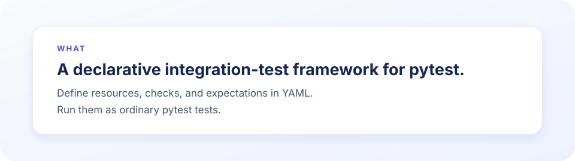
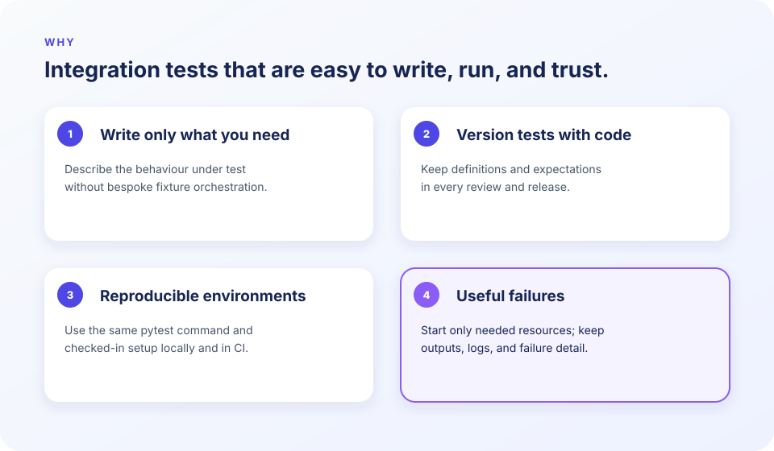

# mgtest

[](https://github.com/MattGalton/mgtest/actions/workflows/ci.yml)

> [!WARNING]
> This is a vibe-coded repository, intended as a spiritual successor to [QMTest](https://github.com/SourceryTools/qmtest).

<p align="center">
  
</p>

<p align="center">
  
</p>

> [!TIP]
> **Start with the [documentation guide](https://mattgalton.github.io/mgtest/).** It explains authoring, running, integrations, evidence, and extensions.

## Get started

Python 3.12+ and Docker are required. Add the core framework and Docker integration,
then create a project:

```sh
uv add mgtest-core mgtest-docker
uv run mgtest init ./mgtest
```

Here is a Docker-backed pizza-shop menu provider. Add these two files to the project
created above.

```yaml
# mgtest/r_pizza_shop.yaml
type: DockerContainer
name: PizzaShopMenuProvider
image: mendhak/http-https-echo:41
ports: {8080: 8088}
auto_start: true
```

```yaml
# mgtest/t_pizza_shop.yaml
tests:
  - type: HttpRequest
    name: pizza_shop_is_ready
    url: http://127.0.0.1:8088/health
    expected_status: 200
    body_contains: '"path": "/health"'
    timeout: 15
    interval: 0.25

  - type: HttpRequest
    name: margherita_can_be_ordered
    url: http://127.0.0.1:8088/menu/margherita
    expected_status: 200
    body_contains: '"path": "/menu/margherita"'
```

The first check retries until the provider
accepts its health request. The second runs only after that and verifies a concrete
GET route for the Margherita menu item.

```sh
uv run pytest mgtest -v
# Or: uv run mgtest run mgtest
```

## Batteries included, integrations optional

Core checks cover commands, HTTP and TCP, files, JSON, archives, baselines, Git,
and local executables. Add only the integrations a project needs:

```sh
uv add mgtest-docker mgtest-redis
# Or: uv add "mgtest-core[services]"
```

Available integrations include Docker, Redis, PostgreSQL, S3-compatible storage,
NATS, and a language server for YAML authoring.

## Documentation

The full guide lives at [mattgalton.github.io/mgtest](https://mattgalton.github.io/mgtest/).
It covers project structure, resource lifetimes, dependencies, evidence, integrations,
the CLI, and extending mgtest with Python. The site is built from this repository and
deployed to GitHub Pages at no hosting cost.

To preview the site locally, serve it from the repository root:

```sh
uvx --from mkdocs-material mkdocs serve
```

Open the local address printed by MkDocs (normally `http://127.0.0.1:8000/`). It
rebuilds the site when documentation files change. Validate a production-style build
with `uvx --from mkdocs-material mkdocs build --strict`.

For contributors, `uv sync --all-packages --group dev` installs the workspace and
`uv run pytest` runs its tests.

## License

Licensed under the [Apache License 2.0](LICENSE).
