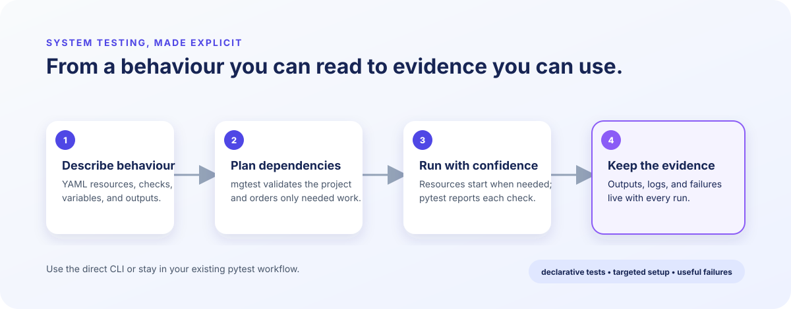

# mgtest

> [!WARNING]
> This is a vibe-coded repository.

**Describe how your system behaves. Run it with pytest.**

[View CI checks](https://github.com/MattGalton/mgtest/actions/workflows/ci.yml)

mgtest makes system tests readable, composable YAML. It starts the things a check
needs, waits for the behaviour you care about, and leaves behind the evidence when
something fails. Each YAML check is collected as an ordinary pytest test, so it fits
the workflow your team already uses.

<p align="center">
  
</p>

## Why mgtest?

| Write what matters | Keep tests dependable | Use the tools you have |
| --- | --- | --- |
| Model services, inputs, checks, and their dependencies in YAML. | Resources start only when needed and are cleaned up according to their scope. | Run through `pytest` or `mgtest`; use built-ins, optional integrations, or Python extensions. |

## Get started

Python 3.12+ is required. Add the core package, create a project, and run it:

```sh
uv add mgtest-core
uv run mgtest init ./mgtest
uv run pytest mgtest -v
```

Put a check in the generated `mgtest` directory:

```yaml
# mgtest/t_health.yaml
type: HttpRequest
name: service_is_healthy
url: http://localhost:8080/health
expected_status: 200
json_equals: {status: ready}
```

The same project can run directly with `uv run mgtest run mgtest`.

## Batteries included, integrations optional

Core checks cover commands, HTTP and TCP, files, JSON, archives, baselines, Git,
and local executables. Add only the integrations a project needs:

```sh
uv add mgtest-docker mgtest-redis
# Or: uv add "mgtest-core[services]"
```

Available integrations include Docker, Redis, PostgreSQL, S3-compatible storage,
NATS, and a language server for YAML authoring.

## Documentation

The full guide lives at [mattgalton.github.io/mgtest](https://mattgalton.github.io/mgtest/).
It covers project structure, resource lifetimes, dependencies, evidence, integrations,
the CLI, and extending mgtest with Python. The site is built from this repository and
deployed to GitHub Pages at no hosting cost.

To preview the site locally, serve it from the repository root:

```sh
uvx --from mkdocs-material mkdocs serve
```

Open the local address printed by MkDocs (normally `http://127.0.0.1:8000/`). It
rebuilds the site when documentation files change. Validate a production-style build
with `uvx --from mkdocs-material mkdocs build --strict`.

For contributors, `uv sync --all-packages --group dev` installs the workspace and
`uv run pytest` runs its tests.

## License

Licensed under the [Apache License 2.0](LICENSE).
