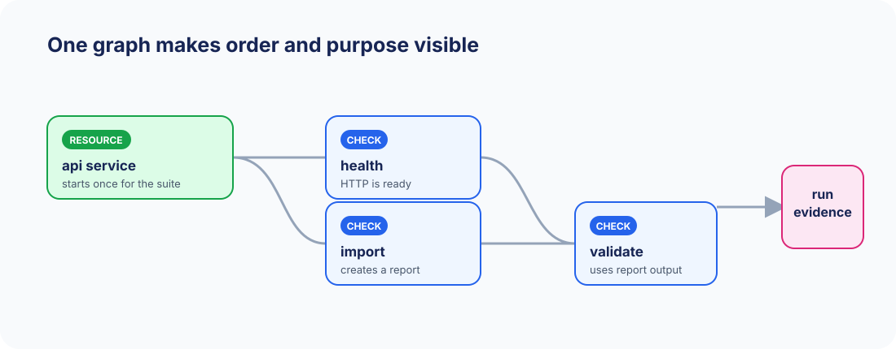

# System tests that explain themselves

mgtest is a declarative framework for the tests that sit beyond your unit suite:
starting a service, calling an endpoint, checking a generated file, or waiting for an
event. Describe those behaviours in YAML and mgtest exposes each check to pytest.


## The useful middle ground

Unit tests prove isolated code. End-to-end tests often hide intent in orchestration
scripts. mgtest gives system behaviour a small, explicit model:

<div class="grid" markdown>

-   :material-file-code-outline: **Readable definitions**

    Resources and checks live beside their configuration. A review can show what the
    system must do without first reading a fixture framework.

-   :material-graph-outline: **Dependencies made explicit**

    A check can consume a resource or another check's output. mgtest plans that graph,
    starts only what it needs, and skips downstream work after a failed prerequisite.

-   :material-folder-search-outline: **Evidence kept nearby**

    Every run records its resolved configuration, outputs, logs, and failures under
    `.mgtest/runs/` for local diagnosis or CI upload.

</div>



## Start in three commands

Python 3.12+ and [uv](https://docs.astral.sh/uv/) are all you need.

```sh
uv add mgtest-core
uv run mgtest init ./mgtest
uv run pytest mgtest -v
```

Then add a check to your project:

```yaml
# mgtest/t_health.yaml
type: HttpRequest
name: service_is_healthy
url: http://localhost:8080/health
expected_status: 200
json_equals: {status: ready}
```

Continue with [writing checks](authoring.md), or see the [integration catalogue](integrations.md).

## Where it fits

mgtest is a pytest plugin, so a YAML file is collected as a normal pytest item. You can
keep Python unit tests and declarative system checks in one CI job, select a suite in
either interface, and get familiar pytest reporting. `mgtest run` is available when a
direct runner is more convenient.

The core package deliberately has a small dependency footprint. Docker, Redis,
PostgreSQL, S3-compatible storage, NATS, and editor language-server support are
separate packages that a project installs only when it needs them.
