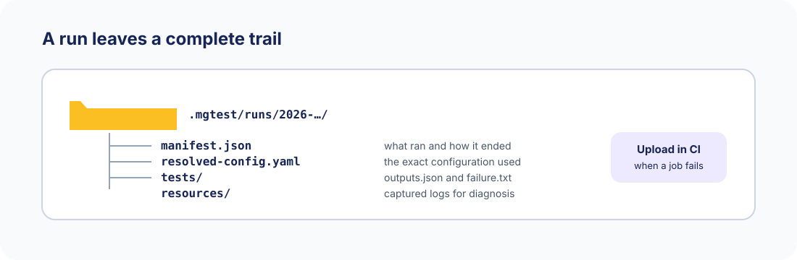

# Run and inspect

Use pytest when mgtest is part of a larger Python test suite, or use the direct CLI
for a focused system-test run.

```sh
pytest mgtest -v
mgtest run ./mgtest
mgtest run ./mgtest s_smoke/s_api
mgtest run ./mgtest s_smoke/s_api/health
```

`mgtest list ./mgtest` prints the suite and check tree. A selector can be a suite path,
a check name, or `suite/path/check`. mgtest validates the full project but starts only
the resources needed by the selected checks.

## Keep the evidence

Every run gets a directory below `.mgtest/runs/<run-id>/`.



Typical contents include:

```text
manifest.json
resolved-config.yaml
tests/.../outputs.json
tests/.../failure.txt
resources/.../logs.txt
```

Upload `.mgtest/runs/` as a CI artifact on failure. Configure cache and retention in
`.mgtest/config.yaml`:

```yaml
cache:
  max_size_mb: 1024
runs:
  max_count: 50
  max_age_days: 30
```

```sh
mgtest home                 # cache and run summary
mgtest home --runs          # recent runs
mgtest home --show-run ID   # inspect one run
mgtest home --doctor        # Git, Docker, Compose, ffmpeg
mgtest home --prune
```

## Expected failures and baselines

Checks pass by default. Set `expected_outcome: failed` for a known failure that should
remain visible without breaking a run. A matching failure is reported as passed; an
unexpected pass fails the run.

Baseline checks compare generated data with checked-in expected data. `FileBaseline`
compares bytes, `JsonBaseline` compares parsed JSON, and `DirectoryBaseline` compares
a whole tree. Put a baseline beside the check that owns it for a clear reviewable
record of expected behaviour.

## Logging

mgtest uses Python logging. Project loading, planning, and check execution are at
`INFO`; operational detail is at `DEBUG`; collection, reuse, and teardown are at
`TRACE`. Set `MGT_LOG_LEVEL=DEBUG` or `MGT_LOG_LEVEL=TRACE` for more detail. For live
pytest output, add `-o log_cli=true --log-cli-level=DEBUG`.
